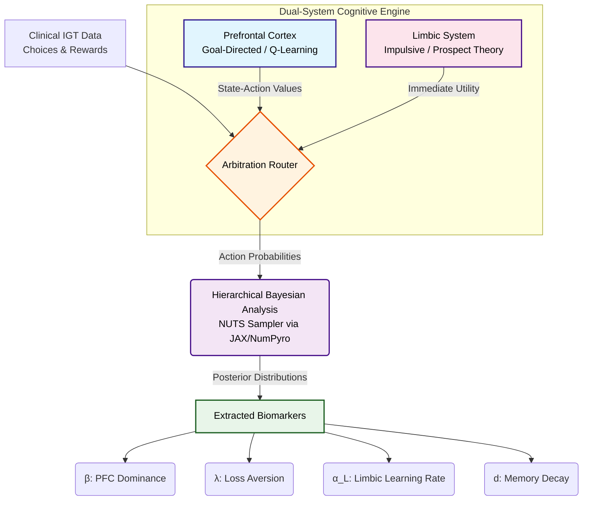

## Computational Pipeline

The following diagram illustrates the flow from behavioral data to the extraction of neurocomputational biomarkers:

---

## Code Structure

* `hba.py`: The Hierarchical Bayesian model implementation using PyMC and JAX/NumPyro **(Run this file to get the HBA-based posterior distributions of the fitted parameters.)**
  
* `analyze_hba_data.py`: Scripts for post-sampling analysis and Bayesian significance testing **(Run significance testing on the `.nc` file output from `hba.py`.)**
  
* `brain_modules.py`: Definitions of the Limbic (PVL) and PFC (Q-Learning) classes.
  
* `likelihood.py`: Core logic for calculating the negative log-likelihood (NLL) of human behavioral sequences.
  
* `main.py`: Parallelized Monte Carlo search for initial parameter exploration **(Run this to obtain Monte Carlo parameter estimates; these estimates are preliminary and may not be statistically significant.)**

---

## Dataset Source

The raw IGT clinical data is publicly accessible via Figshare at: http://figshare.com/articles/IGT_raw_data_Ahn_et_al_2014_Frontiers_in_Psychology/1101324
