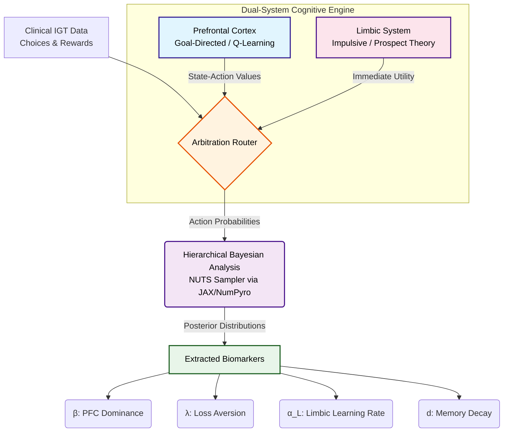

## Computational Pipeline

The following diagram illustrates the flow from behavioral data to the extraction of neurocomputational biomarkers:



---

## Running the HBA Model and Posterior Analysis

The main inferential workflow consists of two steps:

1. Run `hba.py` to fit the hierarchical Bayesian dual-system model and save the posterior samples as a `.nc` file.
2. Run `analyze_hba_dataaa.py` on the saved posterior file to obtain group-level parameter summaries, posterior exceedance probabilities, subject-level summaries, and sampler diagnostics.

### 1. Fit the Dual-System HBA Model

From the project root directory, run:

```bash
python hba.py \
  --model dual \
  --pfc_state_type relative_count \
  --pfc_bin_size 5 \
  --draws 1500 \
  --tune 1000 \
  --chains 2 \
  --target_accept 0.92 \
  --reward_scale 1.0 \
  --output_dir results
```

This command fits the corrected dual-system model with:

* `--model dual`: uses both the limbic/PVL module and the PFC state-action Q-learning module.
* `--pfc_state_type relative_count`: uses the relative deck-count PFC state representation.
* `--pfc_bin_size 5`: bins relative deck-count differences using bin size 5.
* `--draws 1500`: draws 1500 posterior samples per chain after tuning.
* `--tune 1000`: uses 1000 tuning/warmup steps.
* `--chains 2`: runs two MCMC chains.
* `--target_accept 0.92`: sets the NUTS target acceptance probability.
* `--reward_scale 1.0`: uses raw net rewards, matching the Monte Carlo NLL implementation.
* `--output_dir results`: saves the posterior file inside the `results/` directory.

The expected output file is:

```bash
results/dual_hba_relative_count_bin5_posterior.nc
```

### 2. Analyze the HBA Posterior

After the HBA run finishes, analyze the posterior using:

```bash
python analyze_hba_dataaa.py \
  --posterior results/dual_hba_relative_count_bin5_posterior.nc \
  --model dual
```

This script reports:

* group-level posterior summaries for:

  * `βPFC`: PFC arbitration weight,
  * `λ`: PVL loss aversion,
  * `αL`: limbic learning rate,
  * `d`: limbic memory decay;
* pairwise posterior exceedance probabilities between groups;
* subject-level posterior summaries;
* sampler diagnostics including divergences, NUTS tree depth, step size, acceptance rate, R-hat, and effective sample size when ArviZ is available.


---

## Code Structure

* `hba.py`: The Hierarchical Bayesian model implementation using PyMC and JAX/NumPyro **(Run this file to get the HBA-based posterior distributions of the fitted parameters.)**
  
* `analyze_hba_data.py`: Scripts for post-sampling analysis and Bayesian significance testing **(Run significance testing on the `.nc` file output from `hba.py`.)**
  
* `brain_modules.py`: Definitions of the Limbic (PVL) and PFC (Q-Learning) classes.
  
* `likelihood.py`: Core logic for calculating the negative log-likelihood (NLL) of human behavioral sequences.
  
* `main.py`: Parallelized Monte Carlo search for initial parameter exploration **(Run this to obtain Monte Carlo parameter estimates; these estimates are preliminary and may not be statistically significant.)**

---

## Dataset Source

The raw IGT clinical data is publicly accessible via Figshare at: http://figshare.com/articles/IGT_raw_data_Ahn_et_al_2014_Frontiers_in_Psychology/1101324
