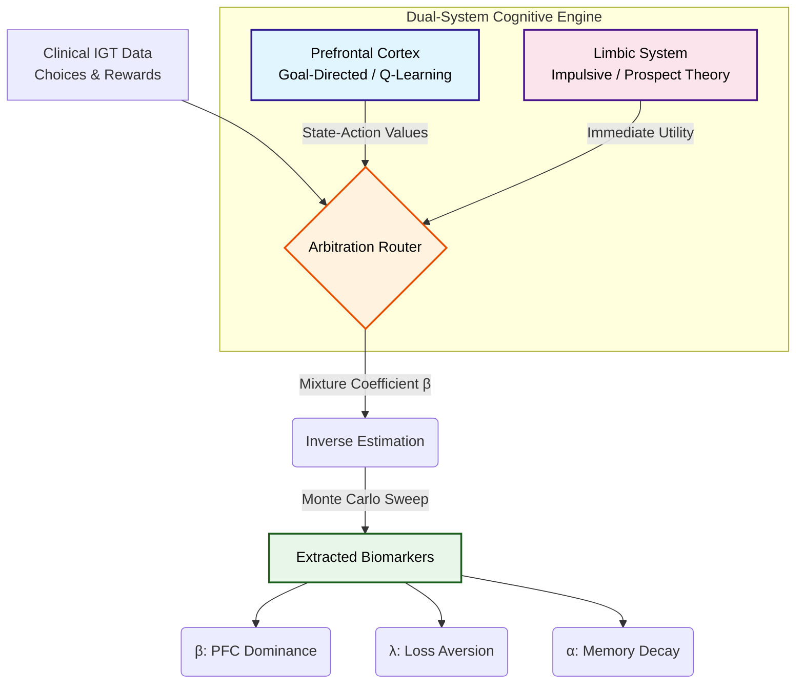

###  The Computational Pipeline

## 🧠 Dual-System Arbitration Model

Analytical long-term planning (Prefrontal Cortex) vs impulsive reward-driven behavior (Limbic System).

---

## 🎴 Iowa Gambling Task Environment

Deceptive reward structure with short-term gains vs long-term outcomes.

---

## 📊 Behavioral Model Fitting Results

Estimated parameters across subject groups (Control vs Substance Use).

### Loss Aversion

### Memory Decay (Somatic Marker)

### Beta_PFC (Weightage of PFC system in decision making)

---

## 📂 Project Structure

- **RL-Agent-for-IGT/** → Artificial agent learning the task  
- **Decision-model/** → Dual-system human decision model  

Detailed documentation is available inside each subproject.

---

## 🎯 Goal

Bridge the gap between artificial reinforcement learning agents and real human decision behavior.

