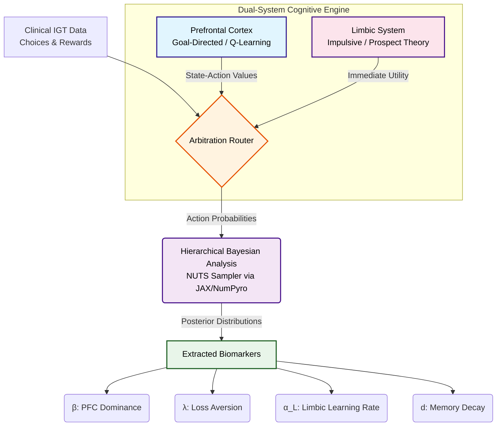

***

# From Limbic Impulse to Prefrontal Control: A Hierarchical Bayesian Dual-System RL Framework

This repository provides the computational implementation for a dual-system reinforcement learning (RL) framework designed to model human decision-making in the **Iowa Gambling Task (IGT)**. The model dissociates affective, present-biased valuation (Limbic System) from deliberative, state-contingent planning (Prefrontal Cortex), providing a mechanistically transparent account of cognitive deficits in substance dependence.

## Overview
Human decision-making emerges from the competition between two systems: a fast, emotional system rooted in limbic circuitry and a slow, goal-directed system resident in the prefrontal cortex (PFC). This project implements this dual-system architecture to identify neurocomputational biomarkers in healthy controls (HC) vs. individuals with heroin or amphetamine dependence. 

### Key Contributions:
*   **Dual-System Architecture:** Integrates Prospect Valence Learning (PVL) with stateful Q-Learning.
*   **Inference Engine:** Utilizes Hierarchical Bayesian Analysis (HBA) with the No-U-Turn Sampler (NUTS) to recover signals often missed by point-estimation methods.
*   **Clinical Insights:** Quantifies differences in loss aversion ($\lambda$) and PFC dominance ($\beta$) across clinical cohorts.

---

## Computational Pipeline

The following diagram illustrates the flow from behavioral data to the extraction of neurocomputational biomarkers:

---

## Model Components

### 1. Limbic Module (PVL)

The limbic system processes immediate rewards and punishments using the Prospect Valence Learning function:

| Condition | Utility |
|------------|----------|
| rₜ ≥ 0 | u(rₜ) = rₜ^ρ |
| rₜ < 0 | u(rₜ) = −λ\|rₜ\|^ρ |

It utilizes a "Somatic Marker" decay mechanism to update stateless action values based on emotional history.

### 2. Prefrontal Cortex Module (Q-Learning)
The PFC module implements a state-based Q-learner. It tracks deck selection counts to build a coarse state representation, allowing for strategic planning and long-term payoff optimization.

### 3. Arbitration Router
A mixture parameter $\beta_{PFC} \in [0, 1]$ determines the weight of the PFC’s strategic input versus the Limbic system’s impulsive input:
                                    $$\pi(a) = \beta \pi^P(a) + (1-\beta)\pi^L(a)$$

---

## Project Structure

* `hba.py`: The Hierarchical Bayesian model implementation using PyMC and JAX/NumPyro **(Run this file to get the HBA-based posterior distributions of the fitted parameters.)**
  
* `analyze_hba_data.py`: Scripts for post-sampling analysis and Bayesian significance testing **(Run significance testing on the `.nc` file output from `hba.py`.)**
  
* `brain_modules.py`: Definitions of the Limbic (PVL) and PFC (Q-Learning) classes.
  
* `likelihood.py`: Core logic for calculating the negative log-likelihood (NLL) of human behavioral sequences.
  
* `main.py`: Parallelized Monte Carlo search for initial parameter exploration **(Run this to obtain Monte Carlo parameter estimates; these estimates are preliminary and may not be statistically significant.)**

---

## Hierarchical Bayesian Analysis (HBA) Results

While preliminary Monte Carlo methods showed directional trends, the **Hierarchical Bayesian Analysis (HBA)** using the No-U-Turn Sampler (NUTS) recovered statistically significant group differences.

### Primary Finding: Group-Selective Loss Aversion ($\lambda$)
The HBA revealed near-certain posterior separation in loss aversion between heroin-dependent individuals and other groups. Heroin users showed a dramatic reduction in $\lambda$, suggesting a "blunting" of the negative affective signals that typically deter risky choices.

| Group | Posterior Mean (λ) | Exceedance Probability P(μHC > μGroup) |
| :--- | :--- | :--- |
| **Healthy Control (HC)** | **0.570** | - |
| **Amphetamine (AMPH)** | **0.531** | 0.5793 |
| **Heroin (HER)** | **0.106** | **0.9953** |

A key structural insight from the HBA was the collapse of $\beta$ toward zero across all groups. This suggests that for standard 100-trial IGT datasets, human behavior is most parsimoniously explained by the stateless Limbic module, as the PFC state-action matrix remains too sparse for complex Q-learning to contribute significantly to the likelihood.

---

## Directional Parameter Estimates (Preliminary Analysis)

The following plots illustrate the mean fitted parameters generated from a first-stage Monte Carlo search across the three groups (Control, Amphetamine, Heroin). These preliminary results provided the directional motivation for the subsequent Hierarchical Bayesian Analysis (HBA).

### Loss Aversion ($\lambda$)
Identifies the sensitivity to losses relative to gains. Lower values in the Heroin group suggest an "aversion-blunting" effect.

### Memory Decay ($d$)
Represents the fading of "somatic markers" over time.

### PFC Dominance ($\beta$)
Represents the degree of cognitive control over impulsive limbic drives.

---

## Usage
To replicate the inference:
1. Ensure the dataset files are placed in `Decision-model/Datasets/`.
2. Run `python main.py` for Monte Carlo point estimation.
3. Run `python hba.py` to initiate the JAX-accelerated Bayesian sampler.
4. Run `python analyze_hba_data.py` to view posterior probabilities and significance results.
